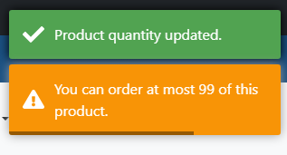

# Relatório de Defeito (Bug Report)

**ID do Caso de Teste Relacionado:** QA-T185 (TC06)  
**Título do Bug:** [Carrinho] Alertas incorretos ao rejeitar limite de quantidade no carrinho  
**Módulo:** Carrinho / Checkout  
**Severidade:** Média  
**Status:** Aberto  

---

## Descrição do Problema
Ao alterar a quantidade de um produto no carrinho para valores fora do limite permitido (vazio, 0 ou > 99), o sistema corrige o valor no campo, porém exibe indevidamente o toast verde de sucesso *"Product quantity updated"*. Em valores acima de 99, o sistema exibe duas mensagens contraditórias ao mesmo tempo.

## Passos para Reproduzir
1. Acessar a aplicação e adicionar um produto ao carrinho.
2. Ir para a tela do Carrinho (`/checkout`).
3. Limpar o campo de quantidade ou digitar `0`.
4. Observar a mensagem exibida na tela.
5. Digitar o valor `100` no campo de quantidade.
6. Observar os alertas exibidos no topo da tela.

## Comportamento Esperado
O sistema deve exibir apenas a mensagem de alerta/restrição (ex: *"You can order at most 99..."*) e NÃO disparar o toast de sucesso verde, já que a ação do usuário foi rejeitada.

## Comportamento Atual
O sistema reverte o valor para o limite permitido, mas dispara o toast verde *"Product quantity updated"* (gerando alertas opostos simultâneos no caso do valor 100).

## Evidência
