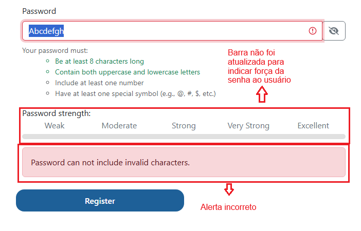

# Relatório de Defeito (Bug Report)

**ID do Caso de Teste Relacionado:** QA-T186 (TC06)  
**Título do Bug:** [Cadastro] Erro de caractere inválido e ausência de indicador de força para senha apenas com letras  
**Módulo:** Autenticação / Cadastro  
**Severidade:** Alta  
**Status:** Aberto  

---

## Descrição do Problema
Ao inserir uma senha contendo 8 caracteres com letras maiúsculas e minúsculas (ex: `Abcdefgh`), a UI marca corretamente os requisitos de tamanho e tipo de letra em verde, porém o medidor de força (*Password strength*) não exibe nenhuma evolução. Ao clicar em **Register**, o sistema exibe a mensagem incorreta *"Password can not include invalid characters"*, em vez de informar que faltam números e caracteres especiais.

## Passos para Reproduzir
1. Acessar a tela de cadastro (Register).
2. Preencher os dados pessoais com valores válidos.
3. No campo **Password**, digitar `Abcdefgh`.
4. Observar a barra de *Password strength*.
5. Clicar no botão **Register**.

## Comportamento Esperado
O medidor de força deve atualizar o status (ex: Moderate/Weak). Ao clicar em **Register**, a mensagem de erro deve indicar apenas que faltam os requisitos pendentes (pelo menos um número e um caractere especial), reconhecendo que a entrada de letras é válida.

## Comportamento Atual
O medidor de força permanece completamente cinza e o sistema exibe o alerta *"Password can not include invalid characters"*.

## Evidência
