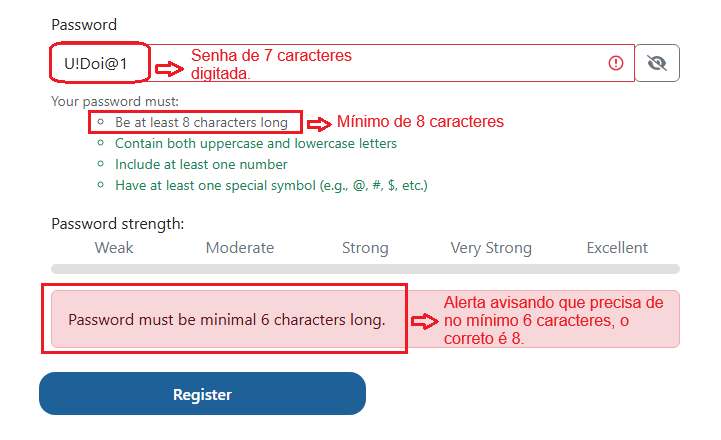

# Relatório de Defeito (Bug Report)

**ID do Caso de Teste Relacionado:** QA-T187 (TC07)  
**Título do Bug:** [Cadastro] Inconsistências na validação de tamanho minimo da senha  
**Módulo:** Autenticação / Cadastro  
**Severidade:** Média  
**Status:** Aberto  

---

## Descrição do Problema
Ao inserir uma senha com 7 caracteres contendo letras maiúsculas, minúsculas, números e caracteres especiais (ex: `U!Doi@1`), a UI valida corretamente os tipos de caracteres exigidos porém ao clicar em **Register**, o backend exibe uma mensagem incorreta dizendo *"Password must be minimal 6 characters long"* (conflitando com os 7 digitados e com a regra de 8 da UI). Além disso, a barra *Password strength* permanece completamente cinza.

## Passos para Reproduzir
1. Acessar a página de cadastro da aplicação.
2. Preencher os campos obrigatórios de cadastro válidos.
3. No campo **Password**, inserir uma senha de 7 caracteres com complexidade atendida (ex: `U!Doi@1`).
4. Observar o comportamento da barra de força da senha (*Password strength*).
5. Clicar no botão **Register**.

## Comportamento Esperado
O sistema deveria aplicar uma regra consistente de limite mínimo de caracteres (ex: 8 caracteres conforme padrão de UI ou 6 de backend) e exibir a mensagem de erro correspondente, além de atualizar dinamicamente a barra de força da senha.

## Comportamento Atual
O backend exibe mensagem divergente ("minimal 6 characters long") e a barra de força da senha permanece inalterada (cinza).

## Evidência

