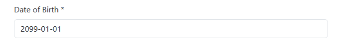

# Relatório de Defeito (Bug Report)

**ID do Caso de Teste Relacionado:** QA-T4 (TC04)  
**Título do Bug:** [Cadastro] Ausência de validação de data futura no campo Date of Birth  
**Módulo:** Autenticação / Cadastro  
**Severidade:** Média  
**Status:** Aberto  

---

## Descrição do Problema
Ao preencher o formulário de cadastro, o campo **Date of Birth** aceita datas futuras (ex: `2099-01-01`) e permite a submissão do formulário sem aplicar qualquer validação de intervalo temporal ou mensagem de bloqueio para o usuário.

## Passos para Reproduzir
1. Acessar a página de registro/cadastro.
2. Preencher os dados obrigatórios com valores válidos.
3. No campo **Date of Birth**, informar uma data no futuro (ex: `2099-01-01`).
4. Submeter o formulário clicando em **Register**.

## Comportamento Esperado
O sistema deve validar a entrada e impedir o cadastro, exibindo um alerta informando que a data de nascimento deve ser menor ou igual à data atual (ou respeitar a idade mínima permitida).

## Comportamento Atual
O sistema aceita a data futura e prossegue com a submissão do cadastro sem emitir nenhum alerta de validação.

## Evidência
