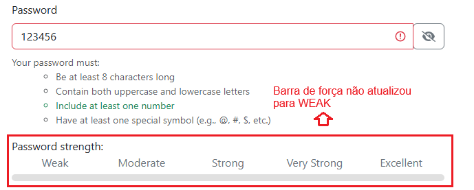
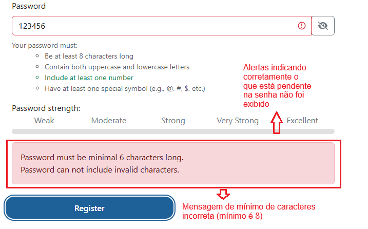

# Relatório de Defeito (Bug Report)

**ID do Caso de Teste Relacionado:** QA-T5 (TC05)  
**Título do Bug:** [Cadastro] Falha na validação de requisitos de UI e mensagens de erro para senha numérica  
**Módulo:** Autenticação / Cadastro  
**Severidade:** Alta  
**Status:** Aberto  

---

## Descrição do Problema
Ao digitar uma senha contendo apenas números e abaixo de 8 caracteres (ex: `123456`), o indicador de força não atualiza para *Weak* e as mensagens de erro ao submeter o formulário indicam um mínimo de 6 caracteres (sendo que o mínimo exigido é 8) além de um falso erro de caractere inválido, visto que a string contém apenas números numéricos comuns.

## Passos para Reproduzir
1. Acessar a tela de cadastro (Register).
2. Preencher os dados pessoais com valores válidos.
3. No campo **Password**, digitar `123456`.
4. Observar a barra de *Password strength*.
5. Clicar no botão **Register**.

## Comportamento Esperado
O indicador de força deve exibir *Weak* e a submissão deve ser bloqueada exibindo os requisitos pendentes de forma clara e correta ao usuário (por exemplo, informando exatamente quais tipos de caracteres ou restrições de tamanho faltam).

## Comportamento Atual
O indicador de força não responde adequadamente e o sistema exibe mensagens de erro divergentes e incorretas sobre limite mínimo e caracteres inválidos.

## Evidências
  
