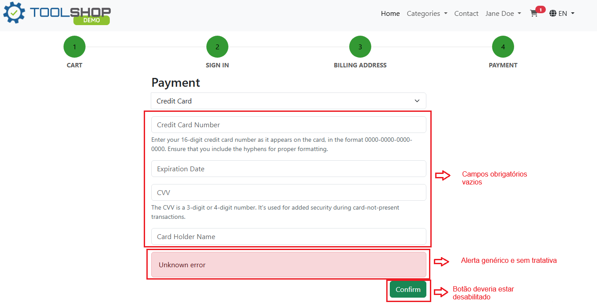

# Relatório de Defeito (Bug Report)

**ID do Caso de Teste Relacionado:** QA-T63 (TC02)  
**Título do Bug:** [Checkout] Ausência de validação visual de campos obrigatórios e exibição de "Unknown error"  
**Módulo:** Checkout / Pagamento  
**Severidade:** Alta  
**Status:** Aberto  

---

## Descrição do Problema
Ao tentar submeter o formulário de pagamento via Cartão de Crédito sem preencher os campos obrigatórios (*Credit Card Number*, *Expiration Date*, *CVV* e *Card Holder Name*), o sistema não exibe os alertas de obrigatoriedade individuais abaixo dos inputs. Em vez disso, exibe um banner genérico de erro com a mensagem *"Unknown error"*.

## Passos para Reproduzir
1. Adicionar um produto ao carrinho e prosseguir até o passo 4 do Checkout (*Payment*).
2. Selecionar o método de pagamento *"Credit Card"*.
3. Deixar todos os campos em branco (*Credit Card Number*, *Expiration Date*, *CVV*, *Card Holder Name*).
4. Clicar no botão *"Confirm"*.

## Comportamento Esperado
O envio deve ser bloqueado no front-end, destacando visualmente em vermelho cada campo obrigatório e exibindo mensagens que orientem o usuário de forma clara (ex: *"Credit Card Number is required"*). O botão “Confirm” deveria estar desabilitado.

## Comportamento Atual
O envio é bloqueado, porém o sistema exibe apenas um alerta vermelho genérico e sem tratativa com a mensagem *"Unknown error"*, sem sinalizar quais campos estão pendentes de preenchimento, confundindo o usuário. O botão “Confirm” continua habilitado.

## Evidência
