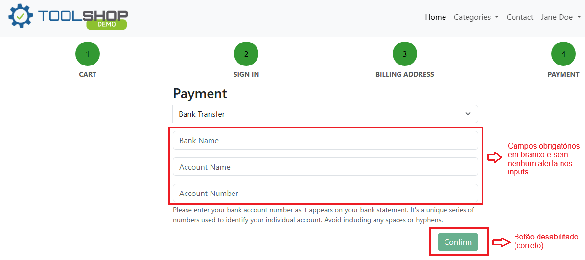

# Relatório de Defeito (Bug Report)

**ID do Caso de Teste Relacionado:** QA-T65 (TC05)  
**Título do Bug:** [Checkout] Botão "Confirm" fica desabilitado sem exibir alertas de validação nos campos de Bank Transfer  
**Módulo:** Checkout / Pagamento  
**Severidade:** Média  
**Status:** Aberto  

---

## Descrição do Problema
Ao selecionar o método de pagamento *Bank Transfer* e tentar confirmar com os campos em branco, o botão *Confirm* passa para o estado desabilitado, porém nenhum feedback visual ou mensagem de validação de campo obrigatório é exibido na tela para orientar o usuário.

## Passos para Reproduzir
1. Adicionar um produto ao carrinho e prosseguir até a etapa de Pagamento.
2. Alterar o método de pagamento para *Bank Transfer*.
3. Manter os campos *Bank Name*, *Account Name* e *Account Number* vazios.
4. Tentar interagir/clicar no botão *Confirm*.

## Comportamento Esperado
O sistema deve destacar em vermelho os campos obrigatórios vazios e exibir mensagens de instrução orientando o usuário, mantendo o botão acessível ou fornecendo feedback adequado sobre a obrigatoriedade.

## Comportamento Atual
O botão *Confirm* fica desabilitado diretamente sem que qualquer mensagem de erro ou destaque visual de validação seja apresentado nos campos do formulário, deixando o usuário sem feedback do motivo do bloqueio.

## Evidência
